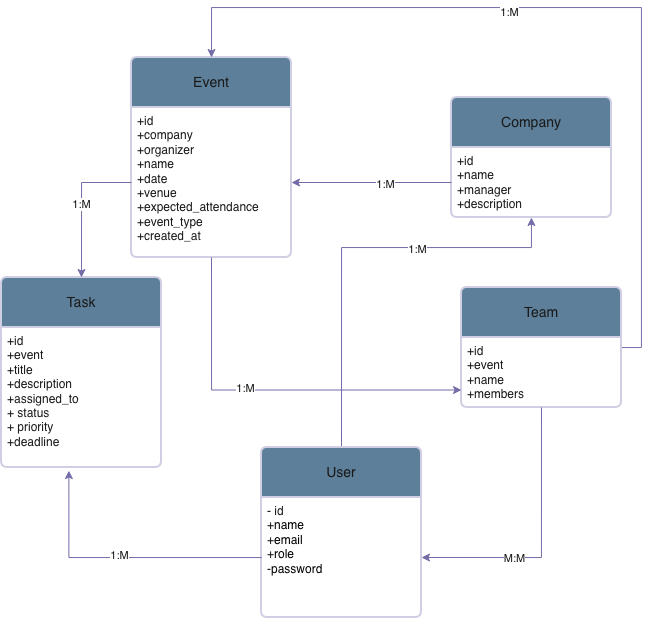

# 🤖 AI-Powered Event Management System - Backend

## 📝 Project Description
This backend powers the **AI-Powered Event Management System**, a platform that automates event planning and staff task distribution using AI.  
It allows Admins, Organizers, Managers, and Staff to collaborate efficiently through a structured workflow and smart task recommendations.

The backend is built using **Django REST Framework**, providing secure APIs for authentication, event management, task automation, and AI integration.

---
## ⚙️ Tech Stack
- **Language:** Python 3.11  
- **Framework:** Django 5 + Django REST Framework  
- **Database:** PostgreSQL  
- **Authentication:** JWT (JSON Web Token)  
- **Containerization:** Docker  
- **AI Integration:** Custom logic for task distribution suggestions  
---
## 🧩 Features
- User management (Admin, Organizer, Manager, Staff)
- Company and event creation
- AI-based automatic task and team distribution
- Manager approval of AI task distribution
- Staff progress updates on assigned tasks
- Role-based authentication and permissions

---

## 🔗 Frontend Repository Link
[Frontend Repository](https://github.com/Ghadaidris/AI-Powered-Event-Management-System-Frontend)

---

## 🔗 Backend Deployment Link
[Backend API](http://localhost:8000)

---

## 🧠 Entity Relationship Diagram (ERD)




---
## 🧩 Project Workflow

1. **Admin** creates users (Organizer, Manager, Staff) and assigns them to companies.  
2. **Organizer** creates events, requests AI suggestions for task distribution, and assigns staff.  
3. **Manager** reviews and approves or edits task distributions.  
4. **Staff** views tasks and updates progress status.

---

## 🛣️ Routing Table

| Entity | Method | Endpoint | Payload |
|--------|---------|-----------|----------|
| **Auth** | POST | `/auth/register/` | Yes |
| **Auth** | POST | `/auth/login/` | Yes |
| **Auth** | GET | `/auth/me/` | No |
| **Admin** | GET | `/admin/companies/` | No |
| **Admin** | GET | `/admin/users/` | No |
| **Admin** | POST | `/admin/users/` | Yes |
| **Admin** | PUT | `/admin/users/{id}` | Yes |
| **Admin** | DELETE | `/admin/users/{id}` | No |
| **Organizer** | POST | `/organizer/companies/` | Yes |
| **Organizer** | POST | `/organizer/events/` | Yes |
| **Organizer** | POST | `/organizer/events/{event_id}/ai/suggest/` | Yes |
| **Manager** | GET | `/manager/events/` | No |
| **Manager** | PUT | `/manager/tasks/{id}` | Yes |
| **Staff** | GET | `/staff/tasks/` | No |
| **Staff** | PUT | `/staff/tasks/{id}` | Yes |

---


| Role          | Description                                 |
| ------------- | ------------------------------------------- |
| **Admin**     | Manages users, companies, and system data   |
| **Organizer** | Creates events, tasks, and teams            |
| **Manager**   | Approves and modifies AI task distributions |
| **Staff**     | Views and updates assigned tasks            |

## ❄️ IceBox Features (Future Enhancements)

- 🤖 **AI Task Optimization** – Improve task assignment logic using AI to suggest ideal staff based on workload and past performance.  
- 📨 **Automated Email Alerts** – Notify users about new roles, events, or team updates.  
- 🛡️ **Advanced Role-Based Permissions** – Add finer-grained access control for more secure management.  
- 🧾 **Comprehensive API Documentation** – Integrate Swagger or ReDoc for better developer experience.  
- 💾 **Data Backup & Recovery System** – Ensure event and user data are safely backed up.  
- 🌐 **Localization for Arabic & English** – Support both languages on the API level.  


## ⚙️ Installation Instructions

### 🐳 Using Docker
```bash
docker compose up --build